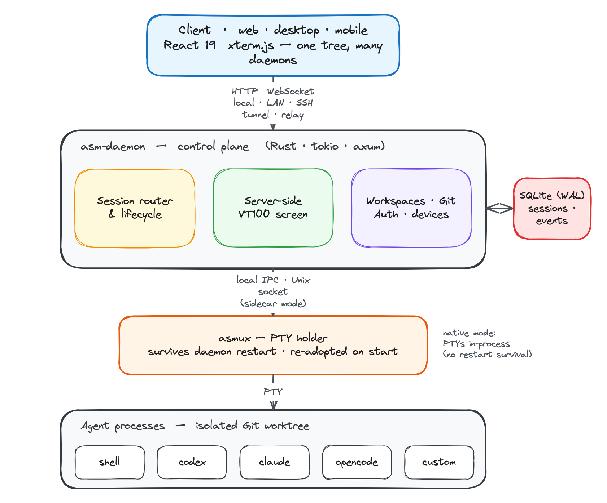

# Agent Session Manager

A personal, cross-platform tool for running long-running **coding-agent sessions**
on your own machines. Start an agent in a workspace, close your laptop, and
reconnect later — from any device — to the *same* live session with no lost
terminal output.

```text
start agent → disconnect → agent keeps running → reconnect → resume the same live session
```

> **Status:** runnable MVP core (Alpha Gate). The daemon proves the central loop
> end to end; the Electron shell and rich output rendering are next. See the
> [MVP execution plan](docs/mvp-execution-plan.md) for what's landed and what's coming.

## Architecture

The **client** is a thin view; the **daemon** owns everything. Sessions are durable
server-side objects, terminal state lives in a server-side VT100 emulator (so a
fresh client resumes the current screen without replaying history), and live PTYs
are held by an out-of-process **asmux** holder that survives daemon restarts.



Full design in [`docs/architecture.md`](docs/architecture.md); durability model in
[`docs/durable-sessions.md`](docs/durable-sessions.md). *(Editable diagram source:
[`docs/architecture.excalidraw`](docs/architecture.excalidraw) — open it in
[Excalidraw](https://excalidraw.com) and re-export `architecture.png`.)*

## What it does

- **Survive disconnects.** Agents run in the daemon, not your client. Detach, crash,
  or switch devices — the session keeps running and you resume the live screen.
- **Survive daemon restarts.** In sidecar mode the asmux holder keeps PTYs alive
  across a daemon restart; the daemon re-adopts them on start. No silent relaunch —
  a dead agent is recorded as `exited`/`failed`/`indeterminate`, never faked.
- **Run any CLI agent.** Built-in plugins for `shell`, `codex`, `claude`,
  `opencode`, and approved `custom` commands — the new-session dialog only offers
  agents whose CLI is actually installed on that host.
- **Isolate concurrent agents.** Each session gets its own Git worktree (auto-named
  branch, a new branch off a base, or an existing branch), so multiple agents on one
  repo never share a working tree.
- **Track changes.** Per-session SCM panel: status, diffs, log, branches, and
  fast-forward pull / rebase / merge of the session branch.
- **Aggregate many hosts.** Connect to several daemons at once; one left-panel tree
  shows every host → workspace → agent. Attention signals flag sessions that are
  active, likely blocked, need approval, or failed.
- **Reach hosts anywhere.** Local, direct LAN (device enrollment + bearer token),
  SSH tunnel, or an outbound **relay** for NAT'd hosts with no port-forward — works
  from mobile.

## Who it's for

- **Solo developers** running coding agents on a workstation, cloud VM, or homelab
  box who want to kick off work and check on it later from a laptop or phone.
- **Power users behind private networks** — NAT, CGNAT, bastions, VPNs, nested
  subnets — who can't or won't expose an inbound port.
- **Self-hosters** who want their agents, sessions, and history on their own
  machines, private to one owner, with no SaaS in the loop.

It is deliberately **not** a team/collaboration system: sessions belong to one
owner, and teammates collaborate through the repository, not through shared live
terminals.

## How it's different

- **vs. `tmux` / `screen`:** those give you a persistent shell but no GUI, no remote
  client model, no per-session Git isolation, and no agent awareness. ASM adds a
  web/desktop/mobile control center, server-side screen snapshots for instant
  resume, worktree isolation, and attention signals — and runs natively on Windows
  without WSL.
- **vs. VS Code Remote / code-server:** those are editor-first. ASM is
  session- and agent-first: the unit of work is a long-running agent that outlives
  your connection, with lifecycle, durability, and multi-agent isolation as the
  core, not an afterthought.
- **vs. hosted/SaaS agent platforms:** ASM is self-hosted and personal. Your code,
  sessions, and memory stay on machines you own; there's no vendor runtime, and it
  drives whatever agent CLIs you already use.

## Setup

New machine? One idempotent script installs the toolchain and does a first build:

```bash
scripts/setup.sh          # prerequisites + debug build
scripts/start.sh          # start the daemon (+ asmux holder), serve the client
```

Then open the daemon's address (`http://127.0.0.1:4600` by default). For the guided
wizard, durable-session flags, remote/relay connectivity, the HTTP API, and tests,
see **[`docs/setup.md`](docs/setup.md)**.

## Layout

```text
crates/daemon/   Rust control-plane daemon (asm-daemon) + asmux PTY holder
client/          React 19 + Vite + xterm.js control center (web now, Electron later)
docs/            requirements, architecture, durability & connectivity plans, setup
scripts/         setup / start / stop / status / wizard / smoke & durability tests
```
